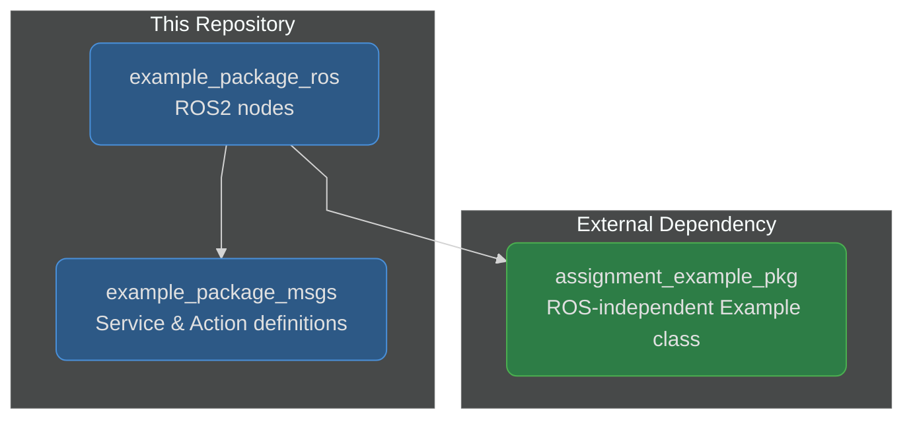
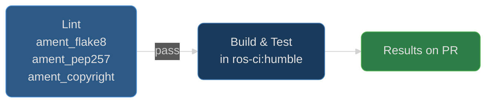

# Example ROS2 Software Packages

[](https://github.com/calebjakemossey/assignment_example_ros_pkg/actions/workflows/ci.yaml)

ROS2 workspace containing interface definitions and nodes that demonstrate topic, service, and action communication patterns.

> **Note**: This project targets **ROS2 Humble** (LTS, supported until May 2027). The original starter code referenced Iron, which reached end-of-life in December 2024.

## Architecture



## Packages

| Package | Description |
|---------|-------------|
| `example_package_msgs` | Custom service (`Example.srv`) and action (`Example.action`) interface definitions |
| `example_package_ros` | ROS2 nodes using `Example` class from `assignment_example_pkg` |

## CI Pipeline

The CI workflow runs on every pull request to `main` and every push to `main`. Linting gates the build-and-test stage - the build does not start until all ament linters pass. Test results are published directly on the PR.



## Release

Releases are driven by Git tags. Pushing a tag that matches `v*` triggers the shared release workflow from [ci-workflows](https://github.com/calebjakemossey/ci-workflows), which builds a Docker image and creates a GitHub Release automatically.

```bash
git tag v1.0.1 && git push origin v1.0.1
```

The resulting image is published to GHCR and can be pulled with:

```bash
docker pull ghcr.io/calebjakemossey/assignment-example-ros-pkg:v1.0.1
```

## Getting Started

See [CONTRIBUTING.md](CONTRIBUTING.md) for workspace setup, building, and testing instructions.

Refer to [example_package_ros/README.md](example_package_ros/README.md) for detailed usage of the ROS2 nodes.

## Development with Docker

The recommended way to build and test is using the CI Docker image, which provides the same environment used by the pipeline:

```bash
docker pull ghcr.io/calebjakemossey/ros-ci:humble
docker run -it -v $(pwd):/ros_ws/src/repo ghcr.io/calebjakemossey/ros-ci:humble bash

# Inside the container:
cd /ros_ws
vcs import src < src/repo/workspace.repos
source /opt/ros/humble/setup.bash
rosdep update && rosdep install --from-paths src --ignore-src -r -y
colcon build --symlink-install
source install/local_setup.bash
colcon test && colcon test-result --verbose
```

This ensures local results match pipeline results.
