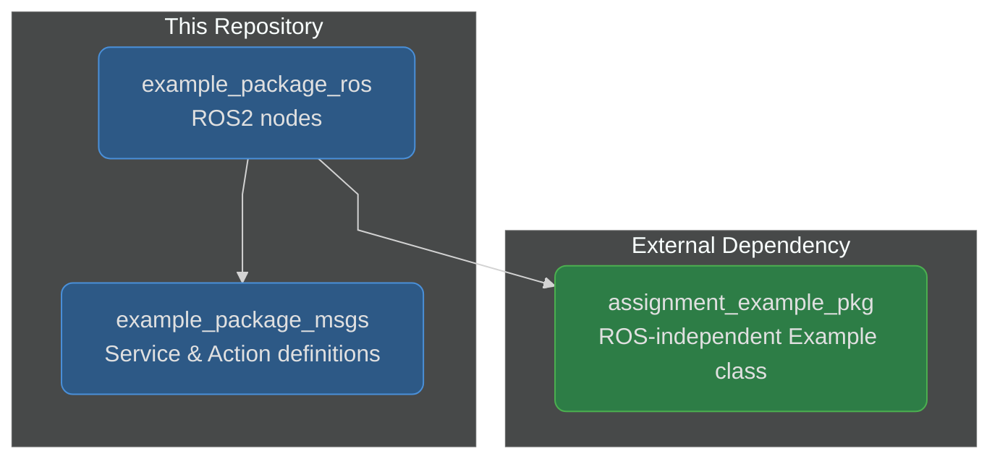

# Example ROS2 Software Packages

ROS2 workspace containing interface definitions and nodes that demonstrate topic, service, and action communication patterns.

> **Note**: This project targets **ROS2 Humble** (LTS, supported until May 2027). The original starter code referenced Iron, which reached end-of-life in December 2024.

## Architecture

## Packages

| Package | Description |
|---------|-------------|
| `example_package_msgs` | Custom service (`Example.srv`) and action (`Example.action`) interface definitions |
| `example_package_ros` | ROS2 nodes using `Example` class from `assignment_example_pkg` |

## Getting Started

See [CONTRIBUTING.md](CONTRIBUTING.md) for workspace setup, building, and testing instructions.

Refer to [example_package_ros/README.md](example_package_ros/README.md) for detailed usage of the ROS2 nodes.
